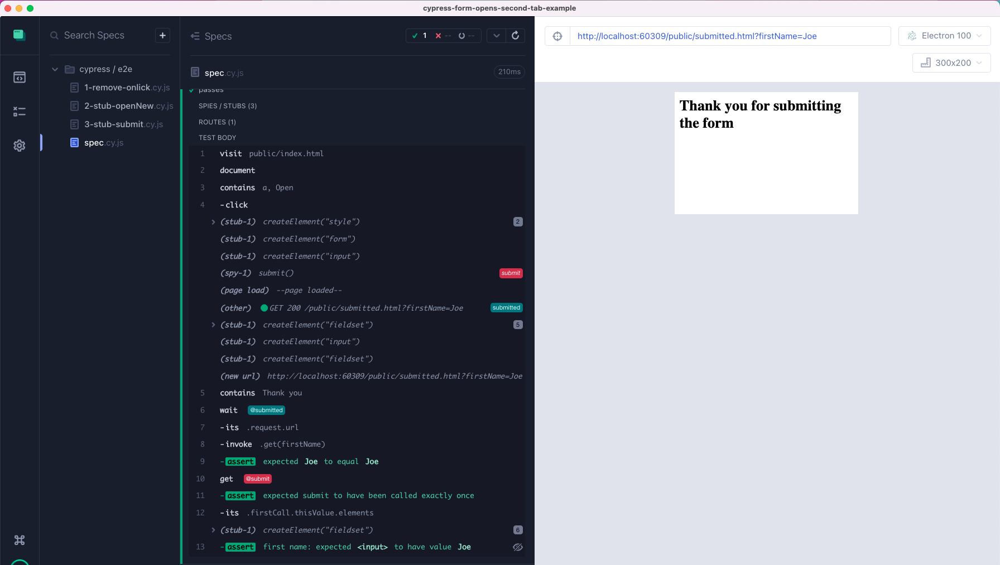

# cypress-form-opens-second-tab-example

>  [](https://github.com/bahmutov/cypress-form-opens-second-tab-example/actions/workflows/ci.yml)

> An example stubbing a form that opens a 2nd tab in Cypress

Read the blog post [Stub The Form That Opens The Second Browser Tab](https://glebbahmutov.com/blog/stub-form-that-opens-2nd-tab/).



## The application

The initial page [public/index.html](./public/index.html) calls the `openNewTab` when the link is clicked. See the code in [public/app.js](./public/app.js). In short, the application submits a form

```js
const form = document.createElement('form')
form.target = option.target || '_blank'
form.action = option.url
form.method = 'GET'

// send some additional information
const name = document.createElement('input')
name.setAttribute('type', 'text')
name.setAttribute('name', 'firstName')
name.setAttribute('value', 'Joe')
form.appendChild(name)

document.body.appendChild(form)
form.submit()
$(form).remove()
```

## The specs

There are several specs showing how to handle the submission and prevent the second tab from opening at all, or redirect it into the current testing browser tab.

- [1-remove-onclick.cy.js](./cypress/e2e/1-remove-onlick.cy.js) removes the `onclick` attribute, so the `openNewTab` is not called at all.
- [2-stub-openNew.cy.js](./cypress/e2e/2-stub-openNew.cy.js) stubs the `window.openNew` method the application calls on click. We then confirm the parameters of the call instead of submitting the form.
- [3-stub-form-submit.cy.js](./cypress/e2e/3-stub-form-submit.cy.js) allows the form to be created, but then it stubs the `submit` method
- [4-stub-form-target.cy.js](./cypress/e2e/4-stub-form-target.cy.js) is the most advanced test. It stubs the form's target attribute to make sure the form is submitted _in the current_ test window. It also confirms the submission in two ways:
  1. by spying on the network call and observing the search parameters
  2. by checking the `form.submit` stub instance to get the form object and its input elements

For more, read the blog post [Deal with Second Tab in Cypress](https://glebbahmutov.com/blog/cypress-second-tab/).
